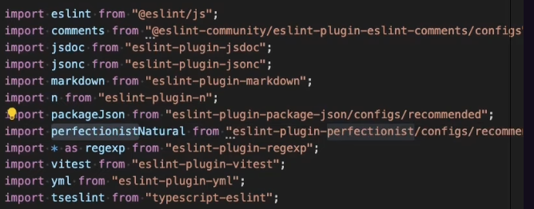
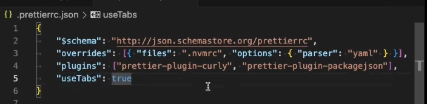
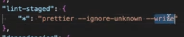

- [[eslint]]
	- put `"eslint.useFlatConfig": *true*,` in your workspace settings `settings.json`
	- LATER Try these eslint   
	  
- [[prettier]]
	- LATER try these `.prettierrc.json` configuration.  
	  
- [[lint-staged]]
	- LATER try `--ignore-unknown` param.  
	  